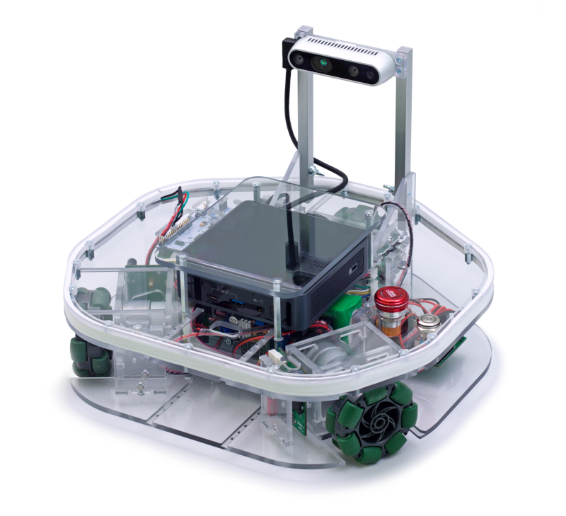

Teleoperation
=============

Robotont
--------

Robotont is an omnidirectionally moving platform meant for educational purposes. The platform is grown out from the Tartu University's football robot at ROBOTEX robot competition, which was customized for teaching. Robotont combines an Intel Realsense 3D depth camera and Intel NUC on-board computer to perform computationally expensive tasks (e.g. 3D mapping) locally on the robot. More information on Robotont is available in `robotont.ut.ee <http://robotont.ut.ee>`_.

Teleoperating Robotont using SSH
--------------------------------

In order to start ROS programs on Robotont, we need to log into the robot.

To make robot visible also with the name not only with the IP aaddress we have to add the robots name into laptop hosts file.

   .. code-block:: bash

      sudo gedit /etc/hosts

And add the line:

   .. code-block:: bash

      192.168.200.<robot number> robotont-<robot number>

For example:

   .. code-block:: bash

      192.168.200.12 robotont-12

In english:

.. nugget::
  :id: 7d8e44d14906422db6492cdafbb04077
  :name: Controlling Robotont from keyboard using SSH

Eesti keeles:

.. nugget::
  :id: a319a6b37fa24dd39250bfe971479795
  :name: Robotondi juhtimine klaviatuurilt üle SSH

Additional information
----------------------

Password: t0ndik00bas

    .. tip:: For security reasons, passwords are not shown as asterisks or bullets when being typed into the terminal. So no panic, your keyboard works just fine. Simply type the password and hit enter.

#. When logged in successfully, you can see that the terminal prompt has changed from :code:`peko@laptop-X` to :code:`peko@robotont-X`. This will be an important reference when trying to figure out which terminal is connected to where.

#. After logging into the robot, the ROS environment should be automatically sourced for you. You can quickly display the last lines of the file with :code:`tail ~/.bashrc` command to examine which workspaces are sourced.

