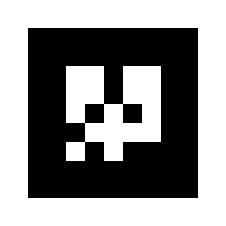
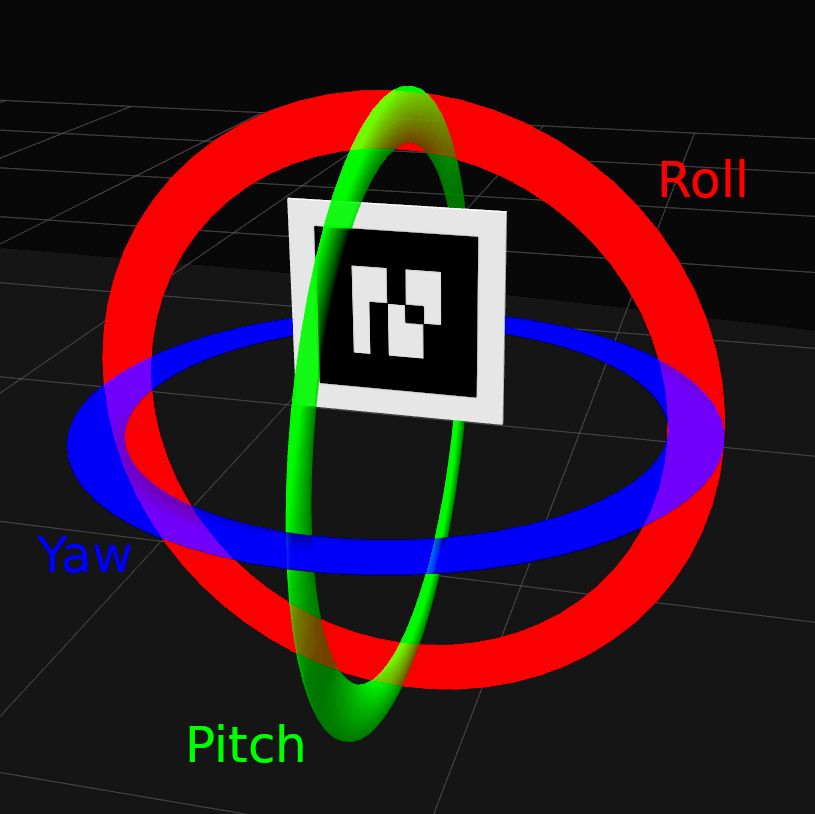

.. _ar_markers:

AR Markers
==========

What are AR markers?
--------------------

AR (Augmented Reality) markers or AR tags are black-and-white images resembling QR codes.
Some examples of AR markers can be seen in the images below.
Note how the black-and-white pattern varies between the markers, remaining unique even if the marker is turned, and how the pattern only contains 90-degree angles.

.. |marker1| image:: images/marker1.png
    :width: 300pt

.. |marker2| image:: images/marker2.png
    :width: 300pt

+-------------+-------------+-------------+
| |marker1|   | |marker2|   | |marker3|   |
+-------------+-------------+-------------+

What makes AR markers useful in robotics, is the uniqueness of every marker and the fact that every marker has a known layout of black and white areas.
Due to the unique and predetermined patterns and the square shape of the AR markers, it is possible to get a lot of useful information about the position and orientation of the marker simply by looking at it.

By the end of today's training, you will have used the orientation information of an AR marker to remotely control a Robotont robot, and made use of the uniqueness of every marker to navigate a maze.

By using a ROS package called `ar_track_alvar` we can get the following raw information from an AR marker:

+-----------------------------------+-------------------------------------------------------+
|.. code-block:: bash               | |robot_with_ar|                                       |
|                                   |                                                       |
|    header:                        |                                                       |
|      seq: 0                       |                                                       |
|      stamp:                       |                                                       |
|        secs: 717                  |                                                       |
|        nsecs: 281000000           |                                                       |
|      frame_id: "camera_link"      |                                                       |
|    id: 2                          |                                                       |
|    confidence: 0                  |                                                       |
|    pose:                          |                                                       |
|      header:                      |                                                       |
|        seq: 0                     |                                                       |
|        stamp:                     |                                                       |
|          secs: 0                  |                                                       |
|          nsecs:         0         |                                                       |
|        frame_id: ''               |                                                       |
|      pose:                        |                                                       |
|        position:                  |                                                       |
|          x: 1.20374426691         |                                                       |
|          y: -0.268434319169       |                                                       |
|          z: 0.0206573474044       |                                                       |
|        orientation:               |                                                       |
|          x: 0.496138277336        |                                                       |
|          y: 0.504417605457        |                                                       |
|          z: -0.50396441133        |                                                       |
|          w: -0.495408479116       |                                                       |
+-----------------------------------+-------------------------------------------------------+

1. Take a look at the information about AR markers in your own terminal by starting the launch file created in the previous section. Then run the following command in another terminal:

  .. code-block:: bash

      rostopic echo /ar_pose_marker

2. Move an AR marker in front of the laptop's camera and observe how the information changes in the terminal.

From this raw information, we can extract three useful groups of information:

#. ID
#. Position
#. Orientation

Let's observe each of these a bit more closely.

ID
--

The markers' ID's are predetermined and known.
A marker with ID 1 always looks the same, and markers with different ID's never look the same.
This means that by seeing the pattern on the marker, it is possible to know what that marker's ID is.
One situation where this could be useful is if you need to find a certain object among other similar objects.
Just detecting the type of the objects might not be enough.
But if each object had a different AR marker on it, and you were looking for the object with marker number 10, you would be able to identify the correct object easily.

Position
--------

The position of an AR marker is its position relative to the center of the camera frame.

In the above image, the AR marker is 1.2 metres in front of the robot (the green line marks 1 m from the wall).
Find this number in the data next to the image.
This is the marker's position's x component and corresponds to the direction indicated in the image with the red arrow.

The y component is -0.26, meaning the marker's horizontal center is 0.26 m to the right of the camera frame's horizontal center.
This direction is marked in the image with the green arrow.

Position in z-axis is close to 0, meaning the marker's vertical center is close to the camera image's vertical center. z-axis is marked in the image with the blue arrow.

Orientation
-----------

Orientation desrcribes which way and how much the AR marker is rotated relative to the center of the camera frame.
The patterns on the markers are fixed and lack symmetry in vertical axis, which means that from the pattern it is possible to determine how much the marker has been rotated (roll).
Since all angles in AR markers are 90 degrees, if the markers are tilted (pitch) or turned (yaw), some angles become less or more than 90 degrees.
From this it is possible to determine the exact angle and direction or the marker relative to the camera.
Another way to describe this is with directional vectors on the straight lines of the marker - these let us know how much and in which direction the marker has been turned.

The raw orientation information from `ar_track_alvar` looks like it could be a representation of orientation in `x`, `y` and `z` axes, with a `w` thrown in as well.
This is not so.
The `x`, `y`, `z` and `w` represent something called a quaternion.
Quaternions are complex mathematical structures used to represent 3D rotations, and must be converted to something else, such as Euler angles in order to be easier to read.
Euler angles describe an object's angles of rotation in X (roll), Y (pitch) and Z (yaw) axes relative to a fixed reference frame.
The three axes are depicted in the two images below.
In our case, the reference frame would be an unrotated marker.

.. |roll_pitch_yaw_2| image:: images/roll_pitch_yaw_2.png
    :width: 300pt

+----------------------+----------------------+
| |roll_pitch_yaw_1|   | |roll_pitch_yaw_2|   |
+----------------------+----------------------+ 
