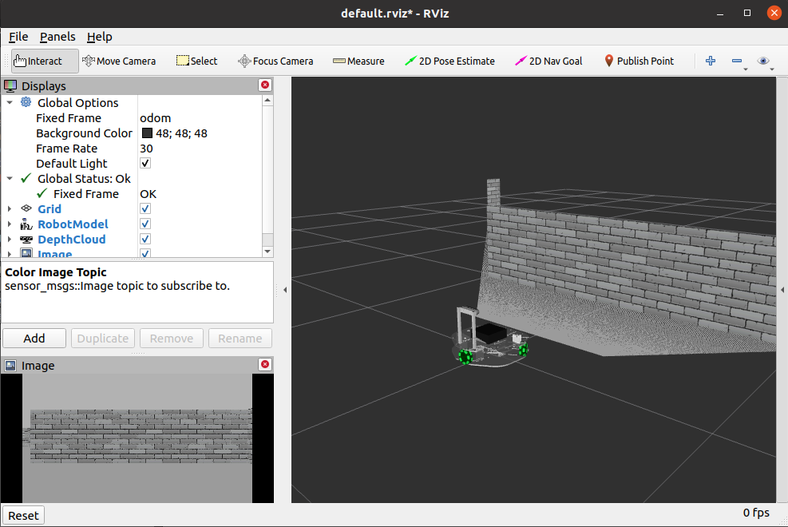

.. role:: bash(code)
   :language: bash

Mapping and navigation in simulated environment
-----------------------------------------------
In this workshop, we aim to demonstrate some advanced robotics capabilities of ROS and its Navigation.
In order to prevent unwanted damage to the robot or it's surroundings, we first use a Robotont in a simulated world.
After everything looks good in the simulation, we try the same on a real hardware. 

Setting up ROS Navigation and Robotont in Gazebo simulation
^^^^^^^^^^^^^^^^^^^^^^^^^^^^^^^^^^^^^^^^^^^^^^^^^^^^^^^^^^^

This workshop relies on several ROS packages, which should already be preinstalled on your portable USB drive. Nevertheless, it does not hurt to enter the apt command again to update the dependencies. The apt commands to install Navigation and some other relevant packages using apt is as follows:

.. code-block:: bash

   sudo apt update
   sudo apt install ros-noetic-navigation ros-noetic-move-base ros-noetic-teb-local-planner ros-noetic-amcl ros-noetic-map-server ros-noetic-gmapping ros-noetic-realsense2-description

Additionally, we need the following packages to exist in our catkin workspace:

.. code-block:: bash

      robotont_nuc_description
      robotont_navigation
      robotont_demos
      robotont_gazebo

In case you have messed up your workspace, here is a copy-paste 4-liner for you:

.. code-block:: bash

   cd ~/catkin_ws
   vcs import --input https://raw.githubusercontent.com/robotont/robotont-setup/noetic-devel/ansible/roles/catkin/files_for_laptops/.rosinstall src
   catkin build
   source devel/setup.bash

Next let’s bring up a Gazebo simulation environment with the Robotont. There are different Robotont configurations available but in this workshop, we are going to use two different configurations: :bash:`robotont_gazebo_nuc` and :bash:`robotont_gazebo_lidar`.

Let’s launch the first configuration, :bash:`robotont_gazebo_nuc`, in a pre-made simulated world that represents a simple maze. Enter the following roslaunch command:

.. code-block:: bash

      roslaunch robotont_gazebo world_minimaze.launch

.. note:: `Gazebo may update its model database when it is started for the first time. This may take a few minutes.`

After a successful launch, the window that pops open should look similar to the :numref:`fig-gazebo-minimaze` below.

.. figure:: ../_static/pics/day3_gazebo_minimaze.png
    :name: fig-gazebo-minimaze
    :width: 500 pt
    :align: center

    Gazebo window with walls to make up a maze and a Robotont model.

Teleoperating the robot in Gazebo and visualization in RViz
^^^^^^^^^^^^^^^^^^^^^^^^^^^^^^^^^^^^^^^^^^^^^^^^^^^^^^^^^^^

Now, let’s explore the Gazebo world and see how ROS handles simulated worlds.
We can use keyboard-based teleoperation for moving the Robotont.
Open a new terminal window and enter:

.. code-block:: bash

   rosrun teleop_twist_keyboard teleop_twist_keyboard.py

Recall the Day 1 and Day 2 for the keyboard controls and drive the robot through the maze.

Robots use cameras and laser sensors to perceive their immediate surroundings. As we already know, In ROS we can use RViz to visualize various sensory information. So start up RViz and add the following Display types:

* RobotModel
* DepthCloud
* Image

After the Displays are properly configured, the view in RViz should look similar to :numref:`fig-robotont-in-rviz`. Go ahead and save the RViz configuration for future use (*File*->*Save*). 

Try to navigate the maze by only looking at the RViz (not the Gazebo) window. When done, shut down all the nodes.
  

    Visualizing Robotont and its sensor feeds in RViz

Creating a 2D map of an environment
^^^^^^^^^^^^^^^^^^^^^^^^^^^^^^^^^^^

Now we are ready to test out mapping and navigating a known map. 

#. Launch the Gazebo world-file in order to simulate the Robotont in the environment.
   However, this time, let’s use a Robotont with a 2D lidar as it will has wider field of view than that of our 3D camera.
   This helps the mapping and localization algorithms to create a maps and localize with higher accuracy for now.

   .. code-block:: bash

      roslaunch robotont_gazebo world_minimaze.launch model:=robotont_gazebo_lidar

#. In the RViz configuration, we can disable (uncheck) the Image and DepthCloud as this Robotont configuration does not contain the depth camera.
   However, let’s add and configure LaserScan to visualize the data from the 2D lidar.

#. Launch the SLAM in order to map the environment using `gmapping <http://wiki.ros.org/gmapping>`_ algorithm:
.

.. code-block:: bash

   roslaunch robotont_demos gmapping.launch

#. Now it’s time to add Map display plugin with topic: :bash:`/map` to our RViz Displays and change the Global Options > Fixed Frame to :bash:`map`.

#. You should see a fragment of a map which is generated based on the current field of view of the robot.
   Use the keyboard-based teleoperation to drive through the entire maze to develop a full map similar to :numref:`fig-robotont-mapping`.

#. When the map appears sufficiently complete, run the map_saver node to save your map using the following command (it will save the map in your working directory under the name mymap):

   .. code-block:: bash

      rosrun map_server map_saver -f mymap

#. After saving the map, shut down all the nodes.

.. figure:: ../_static/pics/day3_robotont_mapping.png
    :name: fig-robotont-mapping
    :width: 500 pt
    :align: center

    Mapping with Robotont

Navigating the maze by sending navigation goals in RViz
^^^^^^^^^^^^^^^^^^^^^^^^^^^^^^^^^^^^^^^^^^^^^^^^^^^^^^^

Next, let’s try to automatically navigate the map, i.e. use some motion planning to move the robot.

#. Launch the Robotont with 2D lidar in a minimaze world.

#. Use the the map_server to publish the previously generated map.

   .. code-block:: bash

      rosrun map_server map_server mymap.yaml

#. Use amcl to start the localization of the robot on the map

   .. code-block:: bash

      rosrun amcl amcl

#. For motion planning, we need to launch the following and wait until “odom received!” is printed on the screen.

   .. code-block:: bash

      roslaunch robotont_navigation move_base.launch

#. Open RViz with Displays including Map, LaserScan, and RobotModel.

   .. hint:: It is very likely that amcl has not placed the Robotont in the right place on the map. If this is, indeed, the case, then use the **2D Pose Estimate** button in RViz to show on the map where the Robotont actually is. 

#. Next, use the 2D Nav Goal button in RViz to set navigation goals for the Robotont on the map. Is the robot able to navigate the entire maze in one go?

   .. tip:: To better interpret motion planning, feel free to add Path to RViz displays. There are 3 different types of motion plans you can visualize as Paths. Try adding three Paths and give each of them a different topic and color.

#. There are several parameters that can be tweaked in order to change the :bash:`move_base` performance. In :bash:`robotont_navigation` package, these parameters are grouped in :bash:`.yaml` files, which can be found from the :bash:`config` folder. Feel free to make changes there, but remember to relaunch :bash:`move_base.launch` for the changes to take effect.

Sending navigation goals with a ROS node
^^^^^^^^^^^^^^^^^^^^^^^^^^^^^^^^^^^^^^^^

While we have just witnessed yet another powerful feature of RViz - the ability to let users specify the navigation goal for a mobile robot -, in  most cases, the navigation goal for a robot is sent by another program (e.g., a decision making node). Therefore, we will next create a ROS node that is able to send navigation goals to the Robotont.

Follow `this <https://ip.festo-didactic.com/DigitalEducation/EITManufacturing/RoboNuggets/FDRenderer/index.html?LearningNugget=10ebac8b02d746ebbca1107426f4fff8&Language=EN&FDEP=true>`_ digital learning nugget up to the 5 min 40 sec mark to create a new package and node to send goals to the Robotont. The learning nugget exemplifies the code of making a robot move to a location of (0.2; 1.0).

Use the know-how from the video to create a node that commands the robot to navigate the complete maze.

In order to test the solution, the Gazebo simulation and the ROS Navigation must be running. That means: 

#. Launch the minimaze Gazebo world with the Robotont with 2D lidar.

#. Start map_server.

#. Start amcl localization.

#. Start move_base for motion planning.

#. Verify if, in RViz, the robot is located approximately at the same position on the map as it is in Gazebo. If not, try to put it roughly in the same position using the **2D Pose Estimate** button in RViz.

#. Run the node that sends navigation goals to the Robotont.

