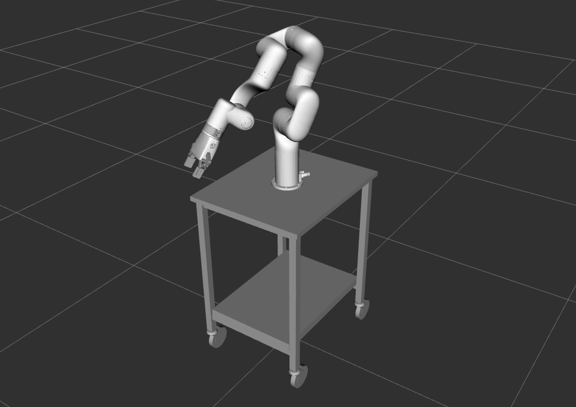

Kinematic descriptions with URDF/XACRO and generating MoveIt configuration packages
===================================================================================

So now that we have established that MoveIt is the ROS software solution for controlling the manipulators and how to use packages provided by the manufacturer. Let’s see how we can use the capabilities of MoveIt with any serial manipulator and how to customize existing robots.

In order to start using MoveIt, we need two things:

#. kinematic description of our manipulator
#. MoveIt configuration package.

Next we are going to use URDF (Unified Robot Description Format) to generate a kinematic description for a fictional robot aironbot and use it to generate the MoveIt configuration package.

If you are new to terminology of kinematics, it is recommended to complete this nugget explaining the most relevant concepts such as links, joints, pose, forward kinematics, and inverse kinematics.

.. nugget::
  :id: 21e7754d33a748fe8667b11b9ea77cc6
  :name: Kinematics
  :activity: RoboNuggets

Creating a new robot description with URDF
------------------------------------------

This nugget is about creating a URDF description of a manipulator robot.

.. nugget::
  :id: 73b4e69eb916433f93cbc5ac2015f4c6
  :name: Creating a manipulator URDF
  :activity: RoboNuggets

Generating MoveIt configuration package from a URDF
---------------------------------------------------

This nugget shows how to generate a new MoveIt configuration package from a URDF description.

.. nugget::
  :id: 91ed275b87d74b859c18a9f44e39e4a0
  :name: Using MoveIt Setup Assistant to generate a MoveIt configuration package
  :activity: RoboNuggets

Adding new components to an existing robot description
------------------------------------------------------

In order to add new components to an existing robot description, we can make use of the power of XACRO. When modifications are required, it is not a good practice to go in and change the third party software (e.g. the robot description package provided by the manufacturer). Instead, we create a new description package and include anything we may need from the manufacturer’s package and/or anywhere else. Thus, for modifying an existing robot, we typically follow these steps:

#. Create a new description package for the customized solution
#. Create a new description file that includes the components we need from the manufacturer’s package
#. Add modifications (e.g. other robots, environment components) in the new description file.
#. Generate a new MoveIt configuration package for the customized description/setup.

In order to mount the xArm7 on a tool cart as shown in the following image, we need to include the description of xArm7 and its gripper. Additionally we need the description for the cart that the robot is mounted on. We have already created a boilerplate package with a description file that contains uncustomized xArm7 and its gripper. Download the the package:

.. code-block:: bash

  git clone https://github.com/unitartu-edu/xarm7_gripper_cart_description

As you see the package contains two folders: meshes and urdf. The meshes folder contains a STL-file for the cart. The urdf folder contains a urdf.xacro-file which includes the xArm7 and the gripper. Feel free to use the urdf_tutorial/display.launch to visualize the provided xacro-file.

When we use XACRO to include other URDF descriptions, we can directly refer to the links and joints defined in the included files, e.g., the links of the xArm7 robot. To mount the xArm7 on the cart, we need to define a link with the geometry from the meshes/cart.stl. Then we need to define a joint that describes the geometric connection (i.e. the kinematic joint) between the cart and the root link of the xArm7 robot.

Feel free to copy the following snippet but do try to understand what it means.

.. code-block:: xml

  <link name="cart">
    <visual>
      <geometry>
        <mesh filename="package://xarm7_gripper_cart_description/meshes/cart.stl" />
      </geometry>
      <material name="silver">
        <color rgba=".75 .75 .75 1"/>
      </material>
    </visual>
    <collision>
      <geometry>
        <mesh filename="package://xarm7_gripper_cart_description/meshes/cart.stl" />
      </geometry>
    </collision>    
  </link>
 
  <joint name="base_to_cart" type="fixed">
    <parent link="cart"/>
    <child link="$(arg prefix)world"/>
    <origin xyz="0 0 0.79" rpy="0 0 -.52" />
  </joint>

Generate a new MoveIt configuration package
-------------------------------------------

Now that we have the new description, we can generate a new MoveIt configuration package for the customized system.
Please note that when generating a collision matrix, we should not allow collisions between the gripper fingers and the cart. Can you figure out how to modify the collision matrix after it has been automatically generated?
