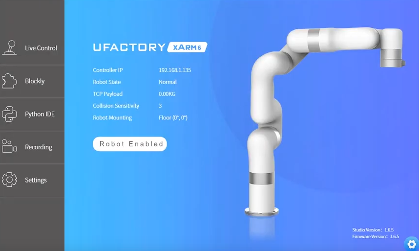

xArm7 safety and xArmStudio live control
========================================

Safety first. Before powering on any robot, make sure that E-stop is activated (i.e. pressed down). Do not release it until you actually intend to make the robot move.

Next we’ll use a network cable to connect a laptop computer with the xArm7 robot. After connecting the cable we also need to change the IP address of the laptop computer. More detailed instructions can be found in this nugget.

.. nugget::
  :id: 04735814656d4ab0a8fd7792dd6a8345
  :name: Connecting to xArm7 via network cable
  :activity: MNestRSI

To confirm that the connection between the laptop and robot is working, test it with ping

.. code-block:: bash

  ping 192.168.1.zzz

Next we’ll try to jog the robot using its web interface. Open a web browser. In the address bar input the IP address followed by ‘:18333’ E.g. 
192.168.1.195:18333

The following web page is displayed. Click on “Live Control”

Disable E-stop and get familiar with the controls. If anything unexpected happens, press E-Stop.
When you are done using the Live Control, press E-stop. And proceed to the next step.
